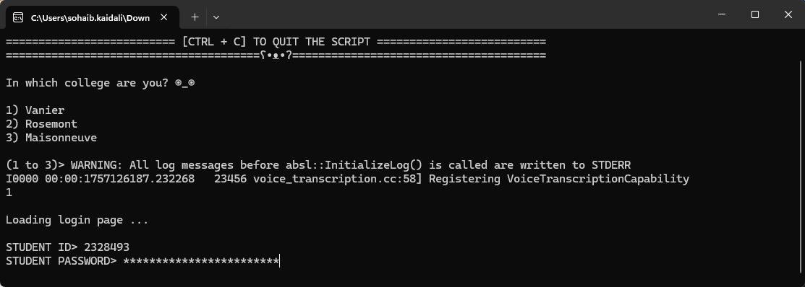
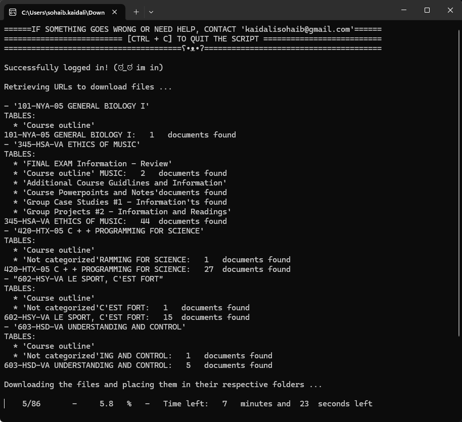

# Omnivox Course Downloader

[](https://www.python.org/downloads/)
[](https://github.com/kaidalisohaib/Omnivox-Course-Downloader/actions)
[](https://opensource.org/licenses/MIT)

An automated Python script that logs into the Omnivox student portal, scrapes all course documents, and organizes them into a local folder structure.




## Table of Contents

- [Omnivox Course Downloader](#omnivox-course-downloader)
  - [Table of Contents](#table-of-contents)
  - [About The Project](#about-the-project)
  - [Key Features](#key-features)
  - [Tech Stack](#tech-stack)
  - [Getting Started](#getting-started)
    - [For End-Users (Recommended)](#for-end-users-recommended)
    - [For Developers](#for-developers)
  - [Usage](#usage)
  - [Technical Challenges \& Lessons Learned](#technical-challenges--lessons-learned)
  - [Future Improvements](#future-improvements)
  - [License](#license)

## About The Project

Manually downloading course files from the Omnivox student portal is a tedious and repetitive task. For each course, students must navigate through multiple pages, categories, and sub-folders to gather all their materials, a process that must be repeated every semester.

This project automates the entire workflow. The script uses Selenium to programmatically log in, handle two-factor authentication, and navigate every course page. It intelligently identifies all downloadable documents, videos, and external links, then downloads and organizes them locally, perfectly replicating the folder structure from the website.

The primary goal is to provide a one-click solution that saves students significant time and provides a complete, organized, offline backup of all their course materials.

## Key Features

-   **Automated Login & 2FA:** Securely handles user credentials and programmatically navigates the Two-Factor Authentication (2FA) process.
-   **Comprehensive Scraping:** Traverses all enrolled courses, extracting document links from complex DOM structures, including content within pop-ups and iframes.
-   **Intelligent Downloading:** Downloads all file types and smartly handles external resources by creating local HTML redirect files for easy access.
-   **Structured Organization:** Replicates the online folder hierarchy locally (`./documents/Course_Name/Category/Sub_Category/`) for intuitive navigation.
-   **Automated Releases:** A CI/CD pipeline using GitHub Actions automatically builds and releases a standalone `.exe` for Windows users with every new version tag.

## Tech Stack

-   **Core Language:** Python 3.10
-   **Web Scraping & Automation:** Selenium, WebDriver Manager
-   **Networking:** Requests
-   **Command-Line Interface:** PyInputPlus
-   **Packaging:** PyInstaller
-   **CI/CD & DevOps:** GitHub Actions

## Getting Started

You can either run the script directly using Python or download the pre-compiled executable for Windows.

### For End-Users (Recommended)

1.  Navigate to the [**Releases**](https://github.com/kaidalisohaib/Omnivox-Course-Downloader/releases) page of this repository.
2.  Download the `main.exe` file from the latest release.
3.  Run the executable and follow the on-screen instructions.

### For Developers

**Prerequisites:**

-   Python 3.10 or newer
-   Git

**Installation:**

1.  Clone the repository:
    ```sh
    git clone https://github.com/kaidalisohaib/Omnivox-Course-Downloader.git
    cd Omnivox-Course-Downloader
    ```
2.  Create and activate a virtual environment:
    ```sh
    # On Windows
    python -m venv venv
    .\venv\Scripts\activate

    # On macOS/Linux
    python3 -m venv venv
    source venv/bin/activate
    ```
3.  Install the required packages:
    ```sh
    pip install -r requirements.txt
    ```

## Usage

Once set up, run the script from your terminal:

```sh
python main.py
```

The script will prompt you to enter your college, student ID, password, and any 2FA codes. After successful authentication, it will begin scraping and downloading your files into a newly created `documents` folder in the same directory.

## Technical Challenges & Lessons Learned

This project presented two significant technical challenges that were crucial for its success:

1.  **Challenge: Handling Dynamic Content and Two-Factor Authentication (2FA)**
    -   **Problem:** The Omnivox portal is a modern web application heavily reliant on JavaScript. A simple HTTP request-based approach would fail at the login stage, especially due to the mandatory 2FA security layer.
    -   **Solution:** I utilized the Selenium framework to automate a real Chrome browser instance. This allowed the script to interact with the webpage just as a human user would. I wrote specific logic to detect the 2FA page, present the authentication options to the user via the command line, and submit the code programmatically. This required careful management of web driver waits to handle asynchronous page loads.
    -   **What I Learned:** This project was a deep dive into automating complex user workflows. I learned how to handle modern web security features, manage browser state, and interact with dynamic, JavaScript-rendered content, skills that are essential for testing and automation.

2.  **Challenge: Scraping Content from Nested iFrames and `onclick` Events**
    -   **Problem:** Many course documents were not accessible via a standard `<a href="...">` link. They were located inside pop-up windows (iframes) and loaded via JavaScript `onclick` events, making their URLs difficult to extract directly.
    -   **Solution:** I developed a multi-step process to handle these cases. The script first programmatically clicks the element to trigger the iframe. It then switches the Selenium driver's context into the iframe (`driver.switch_to.frame(...)`) to access its content. In some cases, I had to reverse-engineer the JavaScript `onclick` functions to parse their arguments and manually construct the final download URL. After scraping, the driver's context was switched back to the main page.
    -   **What I Learned:** This challenge significantly improved my understanding of the browser's Document Object Model (DOM), particularly the concept of window and frame contexts. It also honed my skills in reverse-engineering frontend code to achieve automation goals where no direct API is available.

## Future Improvements

-   **GUI Implementation:** Develop a graphical user interface using a framework like Tkinter or PyQt for a more intuitive and user-friendly experience.
-   **Cross-Platform Packaging:** Expand the GitHub Actions workflow to build and release executables for macOS and Linux.
-   **Configuration File:** Allow users to save non-sensitive information like their college and student ID in a local config file to speed up subsequent runs.
-   **Selective Downloads:** Add functionality to allow users to select which specific courses or folders they want to download.

## License

Distributed under the MIT License. See `LICENSE` for more information.